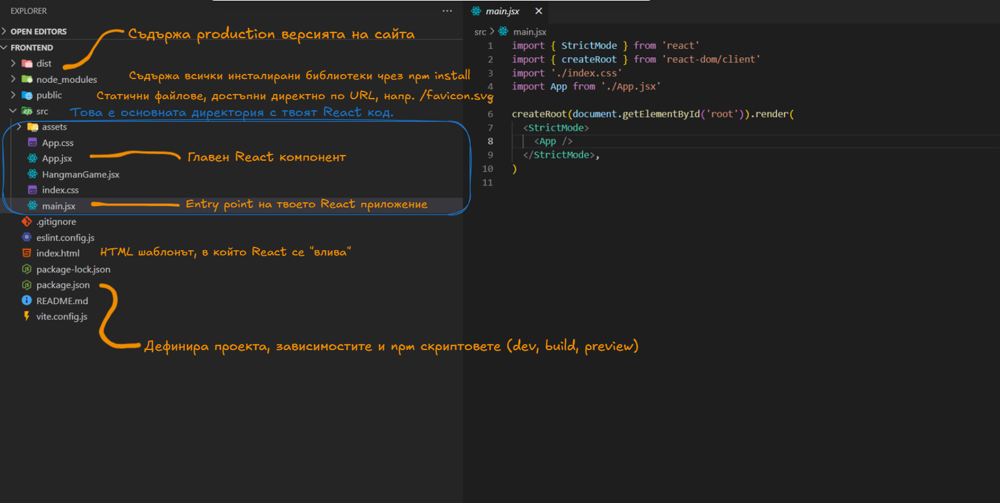
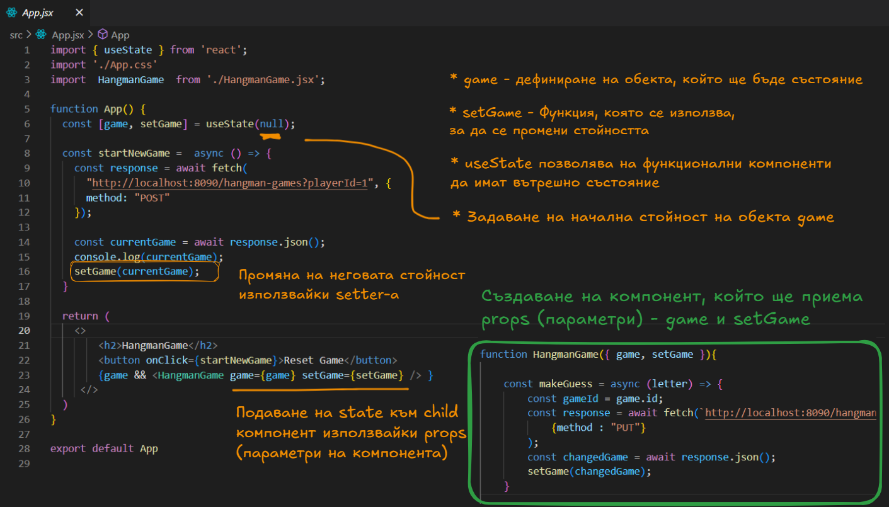

# ***Въведение в JS и работа със SPA - React***

## Въведение
В това занятие направихме първи стъпки в света на динамичните уеб приложения,
като започнахме с основите на JavaScript – езикът, който стои в основата на интерактивността
в съвременния уеб. Разгледахме как JavaScript ни позволява да управляваме поведението
на потребителския интерфейс, да обработваме събития и да променяме съдържанието на
страницата в реално време. След това се запознахме с ключова концепция в уеб разработката
– разликата между рендиране от страна на клиента (Client-side rendering)
и рендиране от страна на сървъра (Server-side rendering), и анализирахме предимствата
и недостатъците на двата подхода. Продължихме с разглеждане на архитектурните
различия между едностранични приложения (Single Page Applications)
и многосписъчни приложения (Multi Page Applications), като обърнахме внимание на това как
потребителското изживяване и производителността се влияят от тези решения. В последната част
направихме въведение в React – една от най-популярните библиотеки за изграждане на
потребителски интерфейси, базирана на компонентен подход, който позволява създаване
на гъвкави, преизползваеми и лесни за поддръжка уеб компоненти.

## Съдържание
- [Въведение в Javascript](#js-intro)
- [Client-side vs Server-side rendering](#client-vs-server-side-rendering)
- [Single vs Multi page application](#single-vs-multipage-apps)
- [Въведение в React](#react)
- [Допълнителни материали](#resources)

<a id="js-intro"></a>
## I. Javascript

При работата с бази данни и съставянето/използването на SQL съществуват
различни школи или стилове, които обхващат различни подходи и парадигми.

### 1. Малко история

#### Раждането на JavaScript - 1995
През 1995 г., докато работи в компанията Netscape, програмистът Брендън Айх създава за само
10 дни нов език за уеб браузъра Netscape Navigator. Първоначалната му задача е да създаде лек
скриптов език, който да се използва от уеб дизайнери, а не само от професионални програмисти.
- Първото име на езика е Mocha, после е преименуван на LiveScript.
- Малко по-късно, с цел маркетинг и популярност, е прекръстен на JavaScript

#### Microsoft и нуждата от стандарт (1996–1997):
- Microsoft създава собствена версия на езика, наречена JScript, която работи в браузъра Internet Explorer.
- Така възникват проблеми със съвместимостта между Netscape и Microsoft браузърите.
- За да се реши това, Netscape предоставя спецификацията на езика на Ecma International, международна организация за стандарти.

#### ECMAScript: стандартът зад JavaScript (1997):
Ecma създава официален стандарт за езика, наречен ECMAScript (ECMA-262).
Оттук нататък JavaScript започва да се развива като реализация на ECMAScript спецификацията.

ECMAScript (съкратено често като ES) е стандарт за скриптови езици, върху който се базира езикът JavaScript.
Той определя как трябва да се държат функциите, обектите, синтаксисът и останалите основни елементи на езика.

* ECMAScript не е сам по себе си език, който се използва директно от разработчици
  – той е спецификация, която описва как трябва да изглежда един език като JavaScript, за да бъде съвместим.
* JavaScript, JScript (на Microsoft) и ActionScript (на Adobe) са езици, които следват ECMAScript стандарта.
* ECMAScript се развива от организацията Ecma International, в частност Technical Committee 39 (TC39).
* JavaScript, както го пишеш в браузъра, е реализация на ECMAScript стандарта + някои допълнения (например DOM API, които не са част от стандарта).

### 2. Основен синтаксис на езика

#### Деклариране на променливи:
JavaScript е динамично типизиран език, което означава, че променливите не са обвързани
със специфичен тип данни и могат да променят стойността си по време на изпълнение.

#### 🔴 `var` – избягвай го

```js
var x = 10;
if (true) {
  var x = 20; // същата променлива!
}
console.log(x); // 👉 20
```
- var игнорира блоковете {} – това може да доведе до грешки.
- Позволява повторна декларация.

#### 🟡 `let` – използвай, ако стойността се променя
```js
let y = 10;
if (true) {
  let y = 20; // нова променлива в блока
  console.log(y); // 👉 20
}
console.log(y); // 👉 10
```
- let работи само в рамките на блока {}.
- Не може да се използва преди да е обявена.
- Не позволява повторна декларация в същия обхват.

#### 🟢 `const` – използвай по подразбиране
```js
const z = 5;
// z = 10; ❌ Грешка – не може да се промени
```
- Задължително изисква инициализация при декларация.
- Стойността не може да бъде променяна чрез повторно присвояване.
- Използвайте const по подразбиране, ако стойността няма да се променя.

#### Създаване на функции в JavaScript

JavaScript ни дава няколко начина за създаване на функции.
Всеки от тях има своите особености по отношение на `hoisting`, 
контекст (`this`) и употреба.

---
#### Function Declaration

```js
function greet(name) {
  return "Hello, " + name + "!";
}

console.log(greet("Maria")); // 👉 Hello, Maria!
```
- Функцията може да бъде извикана преди декларацията

---
#### Function Expression

```js
const greet = function(name) {
  return "Hi, " + name + "!";
};

console.log(greet("Ivan")); // 👉 Hi, Ivan!
```
- Не може да се използва преди декларацията – ще получиш ReferenceError.
---
#### Arrow Function
```js
const greet = (name) => {
  return "Hey, " + name + "!";
};

console.log(greet("Elena")); // 👉 Hey, Elena!
```
- по-кратък синтаксис и идеално за кратки функции и функционално програмиране.
---
#### Template Literals в JavaScript
Template literals (или темплейт низове) са модерен начин за създаване на низове в 
JavaScript, въведени с ES6. Те използват обратни кавички `` ` `` вместо единични `'` 
или двойни кавички `"` и позволяват:

- Използваме `${}` за вграждане на стойност на променлива или израз.
---
```js
const firstName = "Ivan";
const lastName = "Petrov";

// Стандартна конкатенация:
const full1 = "Hello, " + firstName + " " + lastName + "!";

// Template literal:
const full2 = `Hello, ${firstName} ${lastName}!`;

console.log(full1); // 👉 Hello, Ivan Petrov!
console.log(full2); // 👉 Hello, Ivan Petrov!
```
---
#### Default Values
В JavaScript функциите могат да имат **стойности по подразбиране** за параметрите си.
Това означава, че ако при извикване на функция не подадем стойност за даден параметър,
той автоматично ще получи предварително зададена стойност.
- Стойностите по подразбиране се задават само за параметри, които не са подадени или са undefined.
---

```js
function greet(name = "Guest") {
  return `Hello, ${name}!`;
}

console.log(greet("Maria")); // 👉 Hello, Maria!
console.log(greet());        // 👉 Hello, Guest!
```
---
#### Rest оператор
Rest операторът (`...`) позволява да събираме множество аргументи в масив.
Най-често се използва в дефиниции на функции, за да съберем всички предадени параметри в една променлива.

---

```js
function logNames(...names){
  names.forEach(name => {
    console.log(name);
  })
}

logNames("Pesho", "Ivan") // 👉 Pesho Ivan
```

- Тук ...numbers събира всички аргументи в масив numbers.
- Така можем да приемем неопределен брой параметри.
---
#### Създаване на обекти

Обектите са основен тип данни в JavaScript и служат за съхранение на групирани
стойности в ключ-стойност двойки.

---
#### Създаване на обект с литерал

```js
const person = {
  name: "Maria",
  age: 30,
  greet: function() {
    return `Hello, my name is ${this.name}`;
  }
};

console.log(person.name);        // 👉 Maria
console.log(person.greet());     // 👉 Hello, my name is Maria
```
#### Създаване на обект с конструктор

```js
function Person(name, age) {
  this.name = name;
  this.age = age;
  this.greet = function() {
    return `Hi, I am ${this.name}`;
  };
}

const ivan = new Person("Ivan", 25);
console.log(ivan.name);          // 👉 Ivan
console.log(ivan.greet());       // 👉 Hi, I am Ivan
```
#### Достъп и промяна на свойства

```js
const car = {
brand: "Toyota",
model: "Corolla"
};

console.log(car.brand);     // 👉 Toyota

car.model = "Camry";        // Промяна на свойство
console.log(car.model);     // 👉 Camry

car.color = "red";          // Добавяне на ново свойство
console.log(car.color);     // 👉 red
```
#### Използване на класове в JavaScript

Класовете са синтактичен захар (syntactic sugar) върху прототипното наследяване в
JavaScript, въведени с ES6. Те улесняват създаването на обекти с предварително дефинирани свойства и методи.

- Методът constructor се извиква автоматично при създаване на нов обект с new.
- Той инициализира свойствата на обекта.
- Методи се дефинират директно в тялото на класа (без function ключова дума).

---

```js
class Person {
  constructor(name, age) {
    this.name = name;
    this.age = age;
  }

  greet() {
    return `Hello, my name is ${this.name}`;
  }
}

const maria = new Person("Maria", 30);
console.log(maria.greet());  // 👉 Hello, my name is Maria
```
---
#### Работа с Array API в JavaScript
JavaScript масивите разполагат с богат набор от вградени методи (API), 
които улесняват работа с данните – обхождане, филтриране, трансформиране и други.

---
#### Добавяне и премахване на елементи

```js
const arr = [1, 2, 3];

arr.push(4);      // Добавя елемент в края
console.log(arr); // 👉 [1, 2, 3, 4]

arr.pop();        // Премахва последния елемент
console.log(arr); // 👉 [1, 2, 3]
```
#### Итерация и трансформация

```js
const numbers = [1, 2, 3, 4, 5];

// forEach – обхожда без да връща нов масив
numbers.forEach(n => console.log(n * 2));

// map – връща нов масив с резултати от функцията
const doubled = numbers.map(n => n * 2);
console.log(doubled); // 👉 [2, 4, 6, 8, 10]

// filter – връща нов масив със стойности, които отговарят на условието
const evens = numbers.filter(n => n % 2 === 0);
console.log(evens);   // 👉 [2, 4]
```
#### Търсене

```js
const fruits = ["apple", "banana", "cherry"];

// find – намира първия елемент, който отговаря на условието
const found = fruits.find(fruit => fruit.startsWith("b"));
console.log(found);   // 👉 banana

// indexOf – намира индекса на даден елемент (или -1)
console.log(fruits.indexOf("cherry")); // 👉 2
```

<a id="client-vs-server-side-rendering"></a>
## II. Client-side vs Server-side rendering

### 1. Client-Side Rendering (CSR) – Рендиране от страна на клиента
Рендиране на съдържанието на страницата изцяло в браузъра на потребителя, 
използвайки JavaScript. Браузърът зарежда първоначално минимален HTML и 
JavaScript файл, който след това се грижи за създаване на цялата видима
структура на уеб страницата динамично.

#### Начин на работа:
1. Браузърът получава основен HTML файл.
2. Зареждат се JavaScript файловете на клиента (bundle).
3. JavaScript стартира приложението, зарежда данни (напр. чрез API) и рендира съдържанието.

#### Предимства:
– няма презареждане при навигация.
- по-ниско натоварване на сървъра, тъй като рендерирането се случва при клиента.
- гъвкавост и бързина за динамични приложения с много интерактивност.
- използва се кеширане на frontend ресурси – добри резултати при повтарящи се посещения.

#### Недостатъци:
- Бавно първоначално зареждане.
- SEO проблеми, тъй като съдържанието не е налично в HTML-а при първоначално зареждане.

---

### 2. Server-Side Rendering (SSR) – Рендиране от страна на сървъра
Съдържанието на страницата се генерира предварително на сървъра, който изпраща към
клиента напълно готов HTML. Браузърът получава напълно изградената страница,
без да чака за JavaScript, и след това може да добави интерактивност чрез JS.

#### Начин на работа:
1. Браузърът изпраща заявка към сървъра.
2. Сървърът генерира HTML базиран на заявката и го изпраща на клиента.
3. HTML се визуализира директно от браузъра.

#### Предимства:
- Отлична SEO оптимизация, тъй като съдържанието е налично в HTML-а още от сървъра.
- Подходящо за статични страници и маркетинг сайтове, където съдържанието е ключово.

#### Недостатъци:
- По-високо натоварване на сървъра – трябва да генерира HTML за всяка заявка.
- По-бавна навигация между страници, освен ако не се използва комбинация с CSR или caching.
- По-сложна инфраструктура, особено при динамични приложения.

<a id="single-vs-multipage-apps"></a>
## III. Single vs Multi page application

### Single Page Application (SPA)
SPA е уеб приложение, при което цялото съдържание се зарежда в една HTML страница,
а навигацията между „страници“ става чрез JavaScript, без презареждане на браузъра.
При SPA браузърът не презарежда страницата при всяка навигация – 
само частично обновява съдържанието чрез JavaScript.

#### Предимства:
- Бърза и плавна навигация
- Частично обновяване на страницата (без презареждане)
- По-малък трафик след начално зареждане
- Добра поддръжка на offline (чрез PWA)

#### Недостатъци:
- По-бавно първоначално зареждане
- Трудности със SEO
- По-сложна разработка (routing, state management)
- Не работи без JavaScript

#### Използвани технологии:
- React, Angular, Vue, Svelte, Vite
- REST
### Multi Page Application (MPA)
MPA е традиционният модел в уеб разработката – всяка "страница" е отделен HTML документ,
който се зарежда от сървъра при всяка навигация. При MPA всяка заявка към нов URL връща нова HTML страница от сървъра – има пълно презареждане.

####  Предимства:
- Отлична SEO оптимизация
- Ясно разделение между backend и frontend
- Подходящо за сайтове с много съдържание (новини, e-commerce)
- Работи добре без JavaScript

#### Недостатъци:
- Бавна навигация (пълно презареждане)
- По-високо натоварване на сървъра
- По-трудна интеграция на интерактивни елементи

#### Използвани технологии:
- PHP, ASP.NET, Django, Ruby on Rails, Spring MVC
- Server-side templates: Thymeleaf, JSP, Blade, EJS

#### Основни разлики

| Характеристика              | SPA                                         | MPA                                     |
|-----------------------------|---------------------------------------------|-----------------------------------------|
| HTML страници               | Една                                        | Много                                   |
| Навигация                   | С JavaScript                                | С HTTP заявка                           |
| Презареждане                | Не                                          | Да                                      |
| SEO                         | Трудно без SSR                              | Отлично                                 |
| Изискване за JS             | Задължително                                | По избор                                |
| Скорост след първоначално   | Висока                                      | Ниска (пълно зареждане всеки път)       |
| Начално зареждане           | По-бавно                                    | По-бързо                                |

<a id="react"></a>
## IV. React

### 1. Защо е необходим `NodeJS`:
React е библиотека за потребителски интерфейси (frontend), която се изпълнява в браузъра.
Въпреки това, за да разработваме, изграждаме и стартираме React приложения, имаме нужда от Node.js на нашия компютър.
Node.js не е задължителен по време на работата на самото приложение в браузъра,
но е задължителен по време на разработка, билдване и стартиране на dev сървър.

#### Инструменти за разработка:
Node.js позволява да използваме frontend инструменти като:
- Vite или Webpack – за bundling (свързване на всички файлове в едно)
- Babel – за трансформиране на нов JavaScript код до по-стар (ES6 → ES5)
- ESLint / Prettier – за качествен и подреден код
>Всички тези инструменти се инсталират и изпълняват чрез Node.js и npm/yarn.

#### Управление на пакети (npm):
React и всички други библиотеки, които използваш (например react-router-dom, axios, tailwindcss),
се инсталират чрез npm (Node Package Manager)

#### Стартиране на development сървър:
Когато използваш npm run dev или npm start, Node.js стартира локален dev сървър (напр. чрез Vite), който:
- следи за промени във файловете
- автоматично презарежда страницата (hot reload)
- обслужва React приложението в браузъра

#### Създаване на production build:
С команда като npm run build, Node.js:
- компилира JSX и модерен JS код
- минифицира файловете (по-малки размери)
- генерира оптимизирана версия на приложението, готова за деплой
### 2. NPM (Node Package Manager)
NPM (Node Package Manager) е система за управление на пакети, която идва в комплект с Node.js.
Използва се за:
- инсталиране на библиотеки и зависимости
- стартиране на скриптове (build, dev, test)
- управление на версиите на пакетите
- публикуване на собствени JavaScript библиотеки
> При създаване на React проект, почти всичко минава през npm – от инсталиране на React и Vite до стартиране на dev сървъра.

#### Как работи NPM?

package.json – сърцето на всеки проект:
Файлът package.json описва:
- кои зависимости използваш (например react, axios)
- какви скриптове можеш да стартираш (npm run dev, npm run build)
- версия на проекта
- име и описание

```json
{
  "name": "frontend",
  "private": true,
  "version": "0.0.0",
  "type": "module",
  "scripts": {
    "dev": "vite",       
    "build": "vite build",    
    "preview": "vite preview"
  },
  "dependencies": {
    "react": "^19.1.0",
    "react-dom": "^19.1.0"
  },
  "devDependencies": {
    "@eslint/js": "^9.25.0",
    "@types/react": "^19.1.2",
    "@types/react-dom": "^19.1.2",
    "@vitejs/plugin-react": "^4.4.1",
    "eslint": "^9.25.0",
    "eslint-plugin-react-hooks": "^5.2.0",
    "eslint-plugin-react-refresh": "^0.4.19",
    "globals": "^16.0.0",
    "vite": "^6.3.5"
  }
}
```

#### Основни команди на NPM
- `npm install (или npm i)`	Инсталира всички зависимости от package.json
- `npm install <пакет>`	Инсталира даден пакет (напр. npm install axios)
- `npm run <име>`	Стартира скрипт от секцията scripts (например npm run dev)

#### Видове зависимости:

`dependencies`:
- Използвани от приложението по време на работа (production)

`devDependencies`:
- Използвани само по време на разработка

#### Какви файлове създава NPM?

- `package.json` - Списък с всички зависимости, скриптове и метаинформация за проекта
- `package-lock.json` - Заключва конкретните версии на всички пакети (гарантира стабилност)
- `node_modules/` - Папка с всички инсталирани библиотеки и техните зависимости
> ⚠️ Никога не качвай node_modules/ в Git – тя се възстановява с npm install
### 3. Въведение в React
React не е пълен framework, а библиотека, фокусирана единствено върху изграждането на потребителския интерфейс (UI).

Основни характеристики:
- Една от най-популярните JavaScript библиотеки с отворен код за
създаване на потребителски интерфейси
- Използва компонентно-базирана архитектура
- Създадена и поддържана от Facebook (Meta)
- Въведена за първи път през 2013 година
- Използва декларативен подход – описваш как трябва да изглежда UI, 
а не как да се изгради стъпка по стъпка

#### 3.1 За какво се използва React?
React се използва основно за изграждане на модерни уеб потребителски интерфейси, особено при:
- приложения с много интерактивни елементи
- SPA (Single Page Applications)
- Realtime UI – например чатовe, колаборативни инструменти
- Електронна търговия, табла за управление, платформи за социални мрежи
- изграждане на native мобилни приложения чрез React Native
> React е популярен избор за мащабируеми, бързи и лесни за поддръжка приложения.

#### 3.2 Архитектура базирана на компоненти

React е изградена около компоненти – самостоятелни, повторно използваеми елементи, които:
- съдържат собствено състояние (state)
- реагират на промени в данните и рендират отново частите от UI
- се комбинират в по-големи структури, което улеснява изграждането на големи и сложни приложения

#### 3.3 Какво е виртуален DOM ?

Document Object Model (DOM) е потребителският интерфейс на приложението. Когато
приложението се промени, DOM се актуализира, за да отрази промяната.
То представлява структурата и съдържанието на уеб сайт под формата на дърво.

Създаването на т.нар виртуално дърво е в основата на бързодействието, което постига React. 
Виртуалният DOM е просто копие на Real DOM. Той има всички негови
компоненти и функции, но не може да показва страницата на уеб сайт в браузър.
Основната идея, е че React прави минимални промени по истинското DOM дърво, като
обновява само тези елементи, които действително са променени, сравнявайки ги с виртуалното дърво.

>Ето един пример за реален DOM (Document Object Model) – това е структурата, 
> която браузърът изгражда от HTML кода на страницата:

```html
<!DOCTYPE html>
<html>
  <head>
    <title>Primerna stranica</title>
  </head>
  <body>
    <p>Zdr World</p>
    <button onclick="alert('Kliknato!')">Natisni TUK</button>
  </body>
</html>
```

**DOM дървовидна структура:**
Браузърът превръща този HTML в обектен модел (DOM), който изглежда така:
```bash
Document
└── html
    ├── head
    │   └── title
    │       └── "Primerna stranica"
    └── body
        ├── p
        │   └── "Zdr World"
        └── button (onclick)
            └── "Natisni TUK"
```
DOM е обектен модел – браузърът третира всеки HTML елемент като обект,
който можеш да манипулираш чрез JavaScript.

---

Този пример е React функционален компонент, който демонстрира основна концепция в 
React: управление на състояние (state) и реактивен ререндер на UI чрез Virtual DOM.


```js
import React, { useState } from 'react';

function Counter() {
  const [count, setCount] = useState(0);

  return (
    <div>
      <h1>Hello!</h1>
      <p>Count is: {count}</p>
      <button onClick={() => setCount(count + 1)}>Increment</button>
    </div>
  );
}
```

👉 Първоначално
```js
<div>
  <h1>Hello!</h1>
  <p>Count is: 0</p>
  <button>Increment</button>
</div>
```

👉 След клик на бутона
```js
<div>
  <h1>Hello!</h1>
  <p>Count is: 1</p>  <!-- само това се е променило -->
  <button>Increment</button>
</div>
```

**React процес:**
1. Създава нов Virtual DOM.
2. Сравнява го с предишния (diff).
3. Вижда, че само `<p>` елементът е различен.
4. Актуализира само него в реалния DOM.

Това е силата на Virtual DOM – бърза и ефективна промяна, без да се презарежда
целият потребителски интерфейс
### 4. Стартиране и структура на React проект с Vite

Vite (произнася се "вит", от френски "бърз") е модерен инструмент за билдване
и разработка на уеб приложения, създаден от автора на Vue.js – Evan You.

#### 1. Инсталация (Node.js трябва да е инсталиран)

```
npm create vite@latest
```
Ще ти се появят въпроси като:

- ✔ Project name: » <името_на_проекта>
- ✔ Select a framework: » React
- ✔ Select a variant: » JavaScript

#### 2. Влизане в проекта и инсталиране на зависимости
```
npm install
```
Чете файла package.json и инсталира всички посочени зависимости (dependencies) в директорията node_modules.

`package.json`
```json
{
  "dependencies": {
    "react": "^18.2.0",
    "react-dom": "^18.2.0"
  }
}
```

След npm install:

```
/node_modules/
  └── react/
  └── react-dom/
package-lock.json
```

`package-lock.json` заключва точните версии на инсталираните зависимости, 
за да се гарантира, че всеки, който стартира проекта, получава същите библиотеки.

#### 3. Стартиране на проекта

```
npm run dev
```

`npm run dev` е команда, която стартира разработващ (development) сървър за твоя JavaScript/React проект.

Тази команда изпълнява скрипт, дефиниран в package.json:
Пример: `package.json`
```json
{
  "scripts": {
    "dev": "vite"
  }
}
```

`npm` стартира `vite`, който:
- Компилира твоите файлове (React, JSX, CSS и т.н.)
- Стартира локален сървър на http://localhost:5173
- Поддържа Hot Module Replacement (HMR) — автоматично презареждане при промяна в кода
- Променяш код → Vite обновява само променения компонент → браузърът отразява това веднага.

#### Структура на React проект с Vite



### 5. JSX синтаксис

JSX (JavaScript XML) е специален синтаксис, който се използва в React. Неговата основна цел е да улесни
писането и четенето на компоненти, като позволява да се комбинират JavaScript код и
HTML-подобна структура в един файл. По същество, JSX изглежда като HTML,
но всъщност се превежда на чист JavaScript код, който браузърът може да изпълни.

Важно е да се знае, че JSX не е валиден JavaScript сам по себе си — той трябва да
бъде компилиран (транспилиран) до обикновен JavaScript.

Синтаксисът на JSX има някои особености, които е добре да се знаят. Първо, всяко 
JSX изражение трябва да има точно един коренов елемент. Това означава, че ако
искаме да върнем няколко елемента от компонент, трябва да ги обвием в един 
контейнер, като `<div>`, или да използваме специалния React фрагмент `<> ... </>`. Например:

```jsx
<>
  <h2>HangmanGame</h2>
  <button onClick={startNewGame}>Reset Game</button>
  {game && <HangmanGame game={game} setGame={setGame} /> }
</>
```

Второ, при JSX се използват малко по-различни имена на атрибути от стандартния HTML.
Например, за да зададем CSS клас, използваме className вместо class, защото class
е запазена дума в JavaScript. По същия начин за инлайн стилове използваме обекти:

```js
<div style={{ color: 'red', fontSize: '16px' }}>Текст в червено</div>
```

Трето, в JSX можем да вмъкваме JavaScript изрази в кода чрез фигурни скоби {}.
Това позволява динамично генериране на съдържание. Например:

```js
const име = 'Иван';
return <h1>Здравей, {име}!</h1>;
```
### 6. Как да работим с React или 'изграждането на компоненти' като философия
Философията на React се базира на няколко ключови принципа и идеи, които го отличават
от много други библиотеки и рамки за изграждане на потребителски интерфейси. 
Разбирането на тези основни концепции ще ти помогне да схванеш не само как се
използва React, но и защо е толкова популярен и ефективен.

#### [ФИЛОСОФСКИ ПРИНЦИП №1]:
Първият и най-важен принцип е `компонентният подход`. React разглежда целия потребителски
интерфейс като съвкупност от `малки`, `независими` и `преизползваеми компоненти`. 
Всеки компонент описва част от интерфейса – например бутон, форма или цял екран. 
Това позволява да се разбие сложният интерфейс на по-малки парчета, които могат да
се разработват, тестват и поддържат поотделно. Този подход улеснява разделянето
на задачите в екипа и прави кода по-структуриран и модулен.

---

В React компонент е функция (или клас, но в днешно време основно се използват функции), която връща JSX – описанието на част от потребителския интерфейс.
За да наречем нещо компонент, то трябва да отговаря на няколко условия:

- Името започва с главна буква – Това е важно, защото React използва главната буква,
за да различава HTML таговете (`<div>`, `<span>`) от потребителски компоненти (`<MyComponent>`).
- Връща JSX – JSX е разширение на JavaScript, което изглежда като HTML, но позволява и вграждане на логика.
- Може да приема „props“ – входни параметри, които му се подават като атрибути при използване.
- (По избор) Може да използва state (състояние) и hooks, ако има нужда от вътрешна логика или динамично поведение.

**Пример 1**: Това е прост компонент, който създава бутон.
```js
function Button(props) {
  return <button onClick={props.натисни}>{props.text}</button>;
}
```
---

**Пример 2**:
Тук създаваме компонент Forma, който съдържа поле за въвеждане и използва компонента Button.
Така разделяме логиката на бутоните от формата, което прави кода по-чист и по-лесен за поддръжка.

```js
function Forma() {
  function send() {
    alert('Формата е изпратена!');
  }

  return (
    <form>
      <input type="text" placeholder="Въведи името си" />
      <Button text="Изпрати" onClick={send} />
    </form>
  );
}
```
---

**Пример 3**: Компонент за цял екран, който съчетава няколко компонента

Този компонент комбинира други компоненти (Forma и Button) в един по-голям блок,
който представлява цяла страница или екран. По този начин цялото приложение е
съставено от по-малки части, които могат да се развиват и променят независимо.

```js
function HomeScreen() {
  return (
    <div>
      <h1>Добре дошли!</h1>
      <Forma />
      <Button text="Затвори" onClick={() => alert('Затваряне')} />
    </div>
  );
}
```

**Защо този подход е полезен?**
- Всеки компонент изпълнява само една задача и е изолиран от останалите, 
което улеснява тестовете и откриването на грешки.
- Компонентите могат да се преизползват на много места, което намалява повторението на код.
- В екип всеки може да работи върху различен компонент без да се препокриват.
- Ако някой компонент се промени, останалата част от приложението остава незасегната.

#### [ФИЛОСОФСКИ ПРИНЦИП №2]:
Вторият аспект е еднопосочният поток на данни (one-way data flow). Данните в 
React се предават от родителски компоненти към деца чрез пропсите (props). 
Това означава, че данните текат само в една посока, което прави потока на информацията
ясен и лесен за проследяване. Този подход помага да се избегнат обърквания, 
свързани с двупосочната връзка и състояния, които се променят неочаквано.
### 7. State & Props

#### [ФИЛОСОФСИ ПРИНЦИП №3]:

Третият принцип е управлението на състоянието. В React състоянието (state) описва
динамичната част от интерфейса, която може да се променя с времето –
като например броя на кликовете или текста, който потребителят въвежда.
React предлага лесни за използване инструменти като hooks (useState, useEffect и други),
които улесняват управлението и синхронизирането на състоянието с визуализацията.

Концепциите State и Props са в основата на работата с компоненти в React. 
Те управляват начина, по който компонентите си „говорят“ помежду си и как реагират на промени.
Нека ги разгледаме подробно и разбираемо.

#### 1. Props (Properties)
Props са входни параметри за компонент. Те се подават от родителския компонент към
дъщерен компонент – по подобие на аргументи във функция. Props са само за четене – компонентът не трябва да ги променя.

#### 2. State (Състояние)

State е вътрешно състояние на компонент, което може да се променя с времето
– например при натискане на бутон, въвеждане на текст и др. Когато state се промени, 
React автоматично re-render-ира компонента с новите данни.



<a id="resources"></a> 
## V. Допълнителни материали

- [Официална документация, отлична за справки и примери](https://javascript.info/)
- [Видео уроци за JS](https://scrimba.com/learn-basic-javascript-c07)
- [React Official Docs](https://react.dev/) 
- [Видео уроци за React](https://scrimba.com/learn-react-c0e)
